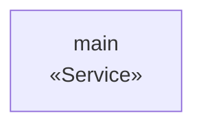
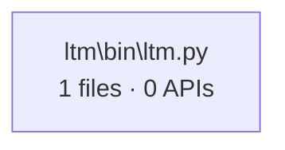

# ecdsa-ocaml — Architecture Documentation

> Generated by [CodeAtlas](https://marketplace.visualstudio.com/items?itemName=codeatlas) on 2026-09-15

## Table of Contents

1. [System Overview](#system-overview)
2. [Feature Clusters](#feature-clusters)
3. [API Catalog](#api-catalog)
4. [Sequence Diagrams](#sequence-diagrams)
5. [Code Health](#code-health)
6. [Diff Summary](#diff-summary)

---

## System Overview

**ecdsa-ocaml** · 1 service

| Service | Technology | APIs | Root Path | Status |
|---------|-----------|------|-----------|--------|
| main | unknown | 0 | `/` | unchanged |

---

## Feature Clusters

### ltm\bin\ltm.py

- **Files:** 1
- **APIs:** 0
- **Cohesion:** 100%
- **Service:** service:main
- **Modularity Q:** 0.000

Member files

- `ltm\bin\ltm.py`

---

## API Catalog

> No APIs detected.

---

## Sequence Diagrams

> No sequence diagrams available.

---

## Code Health

| Metric | Count |
|--------|-------|
| Dead functions (no callers) | 14 |
| God files (>15 symbols) | 1 |
| High coupling files (>10 edges) | 0 |
| Cyclic dependencies | 0 |
| Orphaned clusters | 1 |

**God files:**
- `ltm\bin\ltm.py`

---

## Diff Summary

> No changes detected between baseline and working snapshot.

