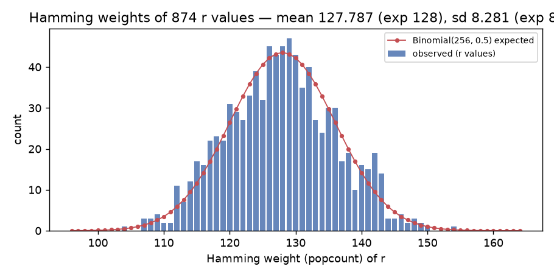
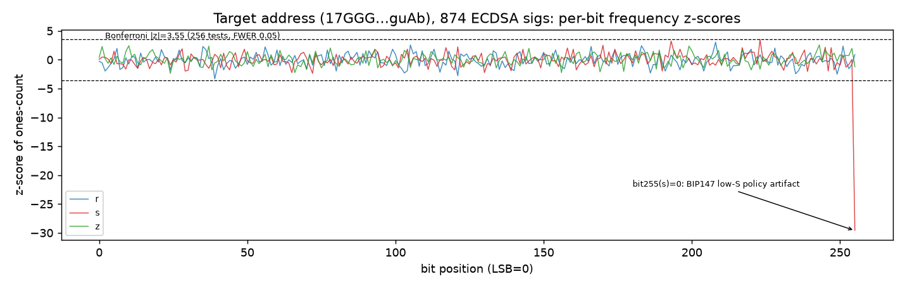
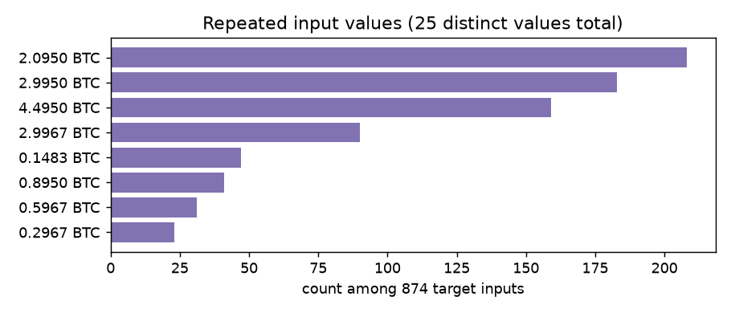
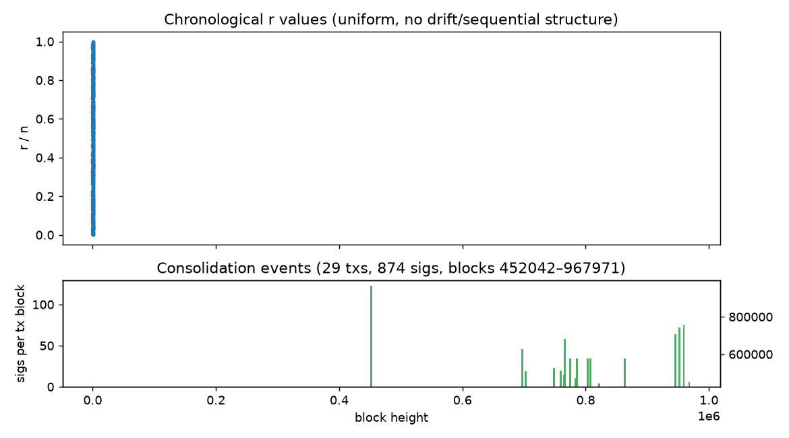

# SIGNATURE_ANALYSIS — 17GGGHWtyi7e1rxnEpcKpE7fHq1UZBguAb

Sample: 874 ECDSA signatures by the target key (pubkey `03507a40492642239fc7eae74bc1f1beb15a6079ea3702cfdaeec2268bb00bcbd0`),
spanning 2017-02-08T03:48:42Z → 2026-09-21T09:33:30Z (29 consolidation txs, blocks 452042–967971).
Context set: all 20449 signatures in the 5,078-tx corpus (1201 distinct pubkeys).
Generated 2026-09-25T04:17:16Z; deterministic seeds (20260925 / 777 / 12345). Machine-readable: `results/target_analysis.json`; figures: `results/figures/`.

## 1–2. Duplicate r / duplicate (r,s) — the decisive check

| set | n | unique r | dup-r groups | unique (r,s) | dup-(r,s) groups |
|---|---|---|---|---|---|
| target key | 874 | 874 | **0** | 874 | **0** |
| all keys in corpus | 20449 | 20449 | **0** | 20449 | **0** |

No repeated nonce fingerprint anywhere in the corpus (per-pubkey scan included). Duplicate-r would enable
trivial key recovery; its absence rules out that class entirely for this dataset.

## 3–4. Range validation and low-S

- All r, s ∈ [1, n−1]; 0 out-of-range (r_min=96312460610716902920106615441184632349910870126422787718750083128522011275, r_max=115780308388555145201166044224363580751754787278420412965766465941443761592666).
- Low-S (s ≤ n/2): 874/874 target, 20449/20449 corpus-wide — full BIP147/BIP62 compliance (post-2015 wallet behaviour).

## 5–6. Per-bit frequency and entropy

| value | samples | min/max ones per bit (exp 437) | max abs z-score | bits abs(z)>3.55 (Bonferroni) | mean per-bit entropy |
|---|---|---|---|---|---|
| r | 874 | 388/482 | -3.315 | 0 | 0.99902 |
| s | 874 | 0/489 | -29.563 | 1 | 0.99525 |
| z | 874 | 402/475 | 2.571 | 0 | 0.99924 |

- Byte-level Shannon entropy: r 7.9932, s 7.9921, z 7.9933 bits/byte (max 8.0).
- **s bit-255 = 0 in all samples (z-score -29.563):** deterministic consequence of low-S normalization (s ≤ n/2 < 2^255) — a policy artifact, *not* RNG bias. Bits 0–254 of s are uniform.
- No bit of r or z deviates beyond the Bonferroni threshold (256 tests, FWER 0.05).

## 7. Hamming-weight distribution

- popcount(r): mean 127.787 (expected 128), sd 8.281 (expected 8.0), range [104, 154].
- KS vs Binomial(256, 0.5): stat 0.04199, p = 0.0892 — consistent.
- popcount(s) mean 127.532, popcount(z) mean 128.34.

## 8. Adjacent-bit statistics

- P(bit_i = bit_i+1): r 0.49943 (z=-0.54), s 0.50137 (z=1.29), z 0.49922 (z=-0.73) — all |z| < 1.3 vs 0.5 expectation.

## 9. r/s/z correlations

- Pearson (normalized): r↔s -0.0697, r↔z -0.0251, s↔z 0.0057 (95% noise band ≈ ±0.068 for n=874).
- Chronological lag-1 autocorrelation: r 0.031, s 0.0169 — no sequential-nonce structure.
- Max abs bitwise r_i↔s_i correlation over 256 bit positions: 0.0939 (no bit position reaches significance after multiplicity correction).
- Uniformity: KS(r/n) p=0.7528, KS(2s/n) p=0.5291, KS(z/2^256) p=0.7084.
- χ² of r,s,z mod small primes (2,3,5,7,11,13,251,257): all within χ²(df) expectations (see results/target_analysis.json → uniformity).

## 10–13. Reuse patterns (inputs, values, scripts)

- 874 inputs in 29 txs; every input has a distinct parent tx; prevout vout indices mostly 1–3; sequences fffffffd/ffffffff.
- Input values: 25 distinct denominations (top: 2.0950×208, 2.9950×183, 4.4950×159, 2.9967×90) — fixed-denomination deposit pattern.
- Outputs of spending txs: round lots (100 BTC ×14, 50 BTC ×5, 40 BTC ×3 …), zero change back to target.
- Output scripts corpus-wide: {"p2pkh": 21043, "p2sh": 8798, "p2wpkh": 597, "p2wsh": 5, "op_return": 5}.

## 14–16. Encoding anomalies, sighash distribution, pubkey consistency

- DER: 100% strict-canonical (0 non-minimal encodings, 0 invalid lengths; sig r||s lengths all 64 bytes → r,s < 2^256).
- sighash: 100% `0x01 SIGHASH_ALL` (corpus-wide, all 20449 sigs).
- Pubkey: exactly 1 compressed key for all 874 target sigs; HASH160 → `17GGGHWtyi7e1rxnEpcKpE7fHq1UZBguAb` ✓; every sig verified against it (OpenSSL + pure-python + PARI).

## 17. Chronological statistics

- Signing epochs cluster in 29 consolidation events; largest gaps up to 1656.9 days; several same-day bursts.
- Hamming-weight mean of r by year: {"2017": 128.22, "2021": 127.34, "2022": 127.86, "2023": 127.25, "2024": 128.79, "2026": 127.65} — stationary, no drift (stable key-generation path over ~9.6 years).

## Assessment

**No cryptographic weakness detected.** Specifically: zero nonce reuse; strict canonical low-S DER throughout;
r consistent with uniform draws (KS p=0.75); s consistent with low-S-normalized uniform draws (KS p=0.53);
no inter- or intra-value correlations beyond noise; no chronological drift. The signature population is
statistically indistinguishable from a correctly-implemented signer (deterministic RFC6979 or strong CSPRNG nonces).

Caveats (stated honestly, per task rules):
- 874 samples detect gross defects (duplicate nonces, truncated nonce spaces, counter behaviour, bit biases ≥ ~4σ).
  Subtle lattice-detectable biases (e.g. a few dropped nonce bits) would need dedicated BKZ/LLL analysis over a larger
  sample and are **not** ruled out by these summary statistics; nothing observed motivates such an attack.
- A statistical deviation is not a vulnerability without independent validation; none was found, so no such claim is made.
